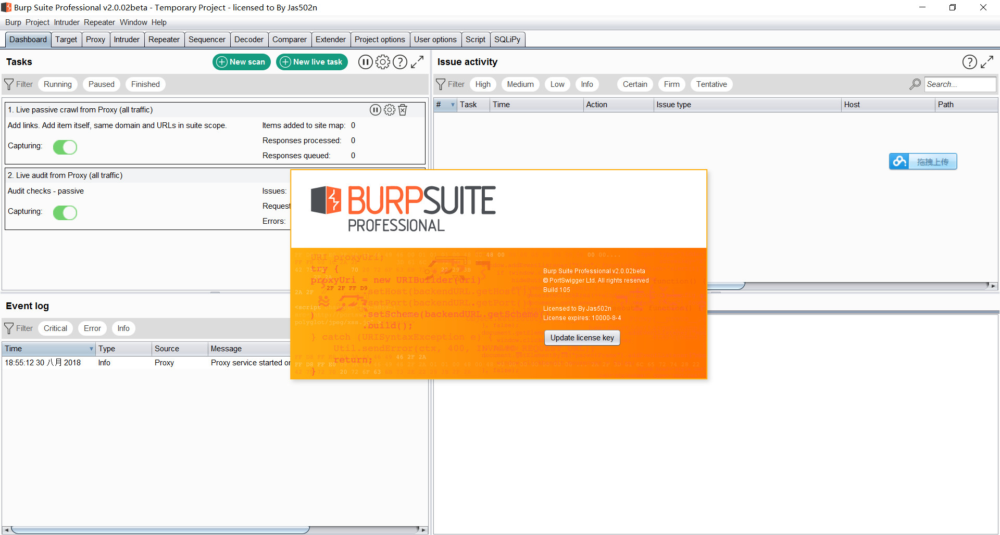

# 更新burpsuite_pro_v2.0beta.jar
```
Burp Suite 2.0 beta现在可供专业用户使用。

这是一项重大升级，具有许多新功能，包括：

一个新的履带，能够自动处理会话，检测应用程序状态的变化，有多次登录抓取和处理挥发物含量。
一种新的扫描引擎，具有自动会话处理，多个扫描阶段，改进的存储输入检测，整合现场被动问题，有效处理频繁发生的插入点，以及优雅处理应用程序错误。
一种新的动态JavaScript分析器，可显着改善对基于DOM的漏洞的检测。
用于监视和控制自动化活动的新仪表板。
新的扫描启动器，以及执行多个并行扫描的能力。
全新的实时扫描功能。
通过中央任务执行引擎改进系统资源管理。
用于存储有用设置的新配置库。
用于与其他工具集成的新REST API。
一个新的响应渲染器，其功能与任何现代浏览器一样。

>>>  md5sum burpsuite_pro_v2.0beta.jar
f7bc22d1ba9c1fda2857b732201c8097  burpsuite_pro_v2.0beta.jar

>>>  sha1sum burpsuite_pro_v2.0beta.jar
54639939a119b8bbe0c9181005f280fc5190e133  burpsuite_pro_v2.0beta.jar

>>>  sha256sum burpsuite_pro_v2.0beta.jar
b260ac99620be4e19090c6a1eac056dc76b558e6bbc6d27d571056eebf959c47  burpsuite_pro_v2.0beta.jar

```


#### 下载链接： https://mega.nz/#!AnAWgKxC!Om4fYfXZbY952YKomuoYWqsyrS7vppkDIy4qbFkQYmg
```
remote: error: File burpsuite_pro_v2.0.01beta.jar is 190.48 MB; this exceeds GitHub's file size limit of 100.00 MB
remote: error: File burpsuite_pro_v2.0beta.jar is 190.19 MB; this exceeds GitHub's file size limit of 100.00 MB

```
# 更新burpsuite_pro_v1.7.37.jar

```
这个版本增加了一些强大的新扫描仪检查，基于James Kettle今天在Black Hat的演讲。

Burp Scanner现在能够检测到两个新的漏洞，"Web缓存中毒"和"请求URL覆盖"

>md5sum burpsuite_pro_v1.7.37.jar
0350199495f1d026363980b581b4aeb9 *burpsuite_pro_v1.7.37.jar

>sha1sum burpsuite_pro_v1.7.37.jar
b6c649adc7275b63d2bc64e1b0e9c788c0c904ce *burpsuite_pro_v1.7.37.jar

>sha256sum burpsuite_pro_v1.7.37.jar
490c1b2abfe7f85e4eb62659b2e4be2a8d894d095a69d91fe4ee129ef6f8e68b *burpsuite_pro_v1.7.37.jar

```

# 更新burpsuite_pro_v1.7.36.jar


```
此版本修复了许多问题，包括：
1.阻止宏编辑器正确显示代理历史记录的错误。
2.扩展UI中的一个错误，其中用于从显示中清除扩展输出的按钮无法正常工作。
3.下载更新期间内存消耗过多的问题。Burp发行版的大小很快就会增加，
以支持许多令人兴奋的新功能，并且建议在发生这种情况之前应用此修复程序。

> md5sum burpsuite_pro_v1.7.36.jar
ee45c40496a5ff427126a82e46465be2 *burpsuite_pro_v1.7.36.jar

> sha1sum burpsuite_pro_v1.7.36.jar
110d3021230c89a707cad686f8188ac3943220fc *burpsuite_pro_v1.7.36.jar

> sha256sum burpsuite_pro_v1.7.36.jar
3324d521e060dcb05697b65f689ef21c54abb90448aed5e8257cdefd3e469ce8 *burpsuite_pro_v1.7.36.jar

```


# 更新burpsuite_pro_v1.7.34.jar


```
一些错误已被修复：

在通过HTTPS轮询时阻止Burp验证Collaborator服务器证书的公用名称的错误。此错误的影响是，如果攻击者在托管Collaborator服务器的网络内执行主动MITM攻击，则他们将能够将交互数据与轮询客户端关联起来。这通常不足以推断具体的漏洞。（请注意，对于与Burp用户位于同一网络中的攻击者，其影响较低，因为攻击者可以查看到应用程序的所有流量，并将请求与相应的Collaborator交互关联起来。）

跟随重定向时可能导致HTTP基本身份验证凭据泄漏到另一个域的错误。此错误的影响是，如果用户为域A配置HTTP基本身份验证，执行域A扫描，域A重定向到域B，并且用户已将域B包括在其目标范围内，则凭据将泄漏。如果用户使用Burp Repeater手动重定向到恶意域，则手动工作时可能会发生相同的泄漏。

一个错误，可能允许活跃的MITM攻击者在BApp Store选项卡中欺骗文本内容并更新对话框。请注意，代码签名可防止MITM攻击者操纵BApp或更新的实际安装。

Burp项目修复功能中的一些错误导致一些实际可恢复的数据丢失。

一个阻止自动完成弹出窗口在某些Linux窗口管理器上关闭的错误。

一个错误，导致临时项目在同一个Burp会话中不止一次保存为基于磁盘的项目。

阻止MacOS应用程序被禁用的错误，结果是当Burp在后台运行时自动活动会减慢。

一个错误，导致代理无法正确处理在请求的URL的域名中使用文字IPv6地址的请求。

已做出以下增强：

Burp ClickBandit已更新为支持沙盒iframe。

在JRuby 9.2.0.0发生更改后应用了一个修复，该修复阻止了Ruby中的Burp扩展运行。


> md5sum burpsuite_pro_v1.7.34.jar
e9917ab71a3581782f5912ec2c2d0def *burpsuite_pro_v1.7.34.jar

> sha1sum burpsuite_pro_v1.7.34.jar
6c52802e0472c4c75ef1d976c20fda6d47e28868 *burpsuite_pro_v1.7.34.jar

> sha256sum  burpsuite_pro_v1.7.34.jar
8f556f27cca14fbde5781fbaea5a962fdecb9aba91d6fcb8dd5b42a961d299ed *burpsuite_pro_v1.7.34.jar

```

# 更新 burpsuite_pro_1.7.33.jar

```
为了支持新的项目修复功能，对Burp项目文件格式进行了更改。新版本与所有先前版本的项目文件向后兼容，但用新版本创建的项目文件不能用旧版本的Burp打开。

1. 宏配置中的一些错误，其中一些Cookie处理设置可能无法在执行Burp时正确保存。
2. 最近发布的自动项目备份功能中的一些小错误。
3. 即使用户禁止使用协作者，扩展仍然可以获得对Burp协作者客户端的API访问权限的错误。

> md5sum burpsuite_pro_1.7.33.jar
cb6e5a00979463a2be634b6d5388bc49 *burpsuite_pro_1.7.33.jar

> sha1sum burpsuite_pro_1.7.33.jar
4ce0e13f73a981ba3090f58c3aed9763432651ea *burpsuite_pro_1.7.33.jar

> sha256sum burpsuite_pro_1.7.33.jar
44bb6811f838aa6e3a47b0dc0d4ef5f7fbddc031ca5efe2d8bb5f24eb105dc12 *burpsuite_pro_1.7.33.jar

```

# 更新 burpsuite_pro_v1.7.32.jar
```
> sha256sum burpsuite_pro_v1.7.32.jar
49c719e86611ccfdcda8cd23fac8edb236369dd8d0e7133068eaf40315e52206 *burpsuite_pro_v1.7.32.jar

C:\Users\CTF\Desktop
> sha1sum burpsuite_pro_v1.7.32.jar
c6cd0bbe402b75f4806d76a04d251474308415b8 *burpsuite_pro_v1.7.32.jar

C:\Users\CTF\Desktop
> md5sum burpsuite_pro_v1.7.32.jar
d4d43e44769b121cfd930a13a2b06b4c *burpsuite_pro_v1.7.32.jar


```

# BurpSuite_Pro_v1.7.31

Download loader/keygen here: http://www36.zippyshare.com/v/WRy3bGWf/file.html


# Use-Age:

```
      java -jar burp-loader-keygen.jar
```


## 0x01 Run-BurpSuite_Pro_v1.7.31


## 0x02 Copy-license


## 0x03 Click-Manual-Activation


## 0x04 Copy-Request-To-KeyGen-Request 


## 0x05 Copy-Activation-Response-To-Burp


## 0x06 Success-License


Your Burp Pro Alive!
Enjoy Now!!!


### License Expires : 10000-1-4

# 反编译jar For Linux Command：
```
      -classpath <路径>            指定查找用户类文件和注释处理程序的位置
      
      -d <目录>                    指定放置生成的类文件的位置
      
      cd  burp-loader-keygen.jar.src
      
      javac -classpath burp-loader-keygen.jar -d . enjoy/reversing/me/KeygenDialog.java
```


### sha1值
```
      a4308cc872bac6980a2e4fc8b6abece78e21bc95  burpsuite_pro_v1.7.31.jar

      63ef57aa0fd7fdb6f6d2171cf946177c9c23b195  burp-loader-keygen.jar

```
### sha256值


```
      6530b29367de2b0fa42c411f94ae734d745443256431aee0fe221acb7a75c103  burp-loader-keygen.jar

      84bf3cbae91c621e4fb3c411409293e7759ba2b7ff3d2de4a1749383afcc6b90  burpsuite_pro_v1.7.31.jar

      f9214a26dae4236709435d337b5f90d26b089d54b3a0885895f412ce29214f66  burp-loader-keygen-jas502n.jar

```


